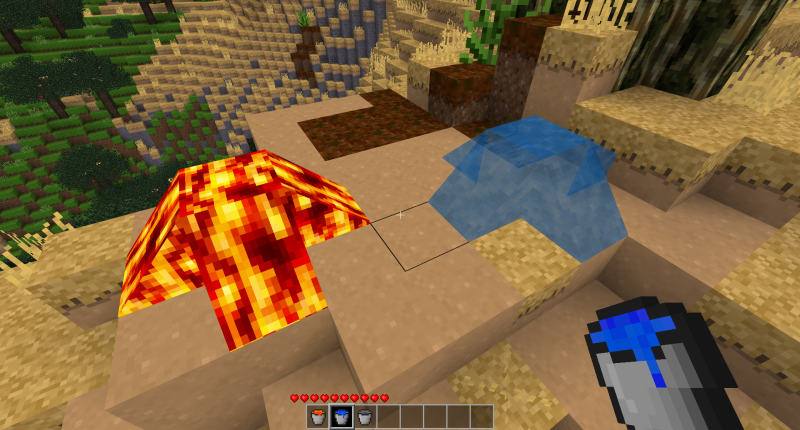
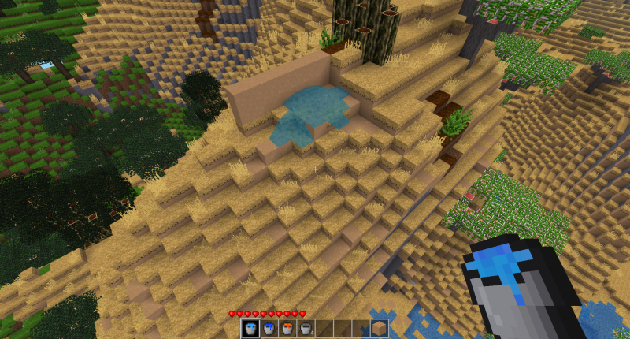
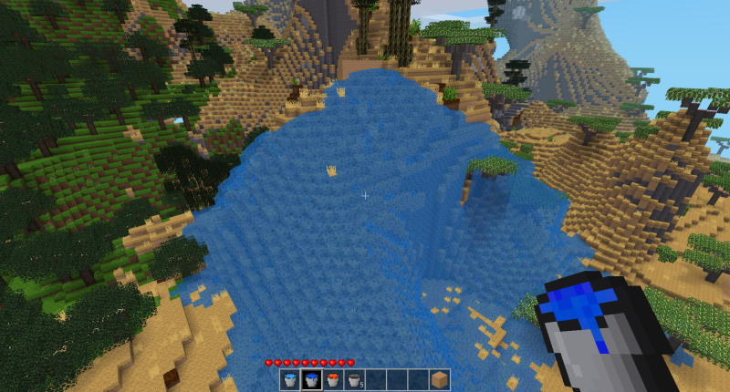
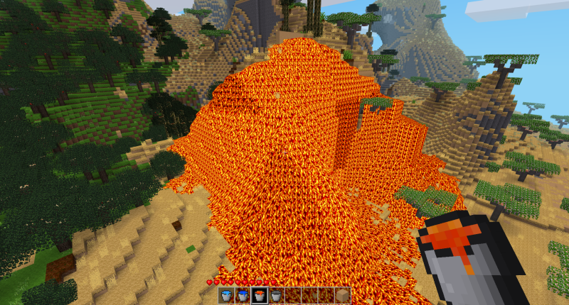
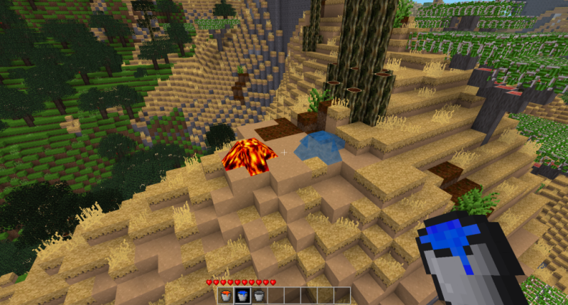
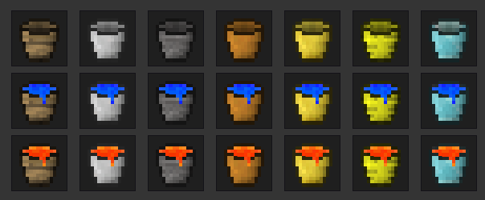
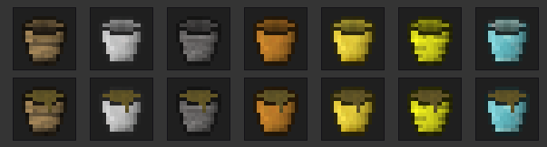
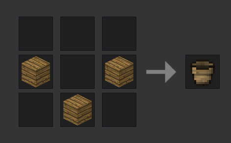
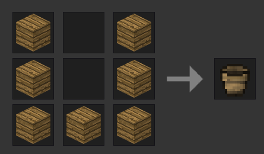

# Bucket lite **[Minetest mod]**

Fork of **Minetest Game mod: bucket**

- only one bucket for water and river water types (with bucket_unify_river_water=true)
- flowing is only one block to prevent flooding with one bucket
- If "bucket water" gets in contact with normal water or river water, then the bucket water changes to this type.
- If "bucket lava" gets in contact with water, or default lava, the bucket lava changes to default type - this can result in lava flooding. Just don't mess up with lava :)
- liquid can be taken from flowing liquid - you don't have to look for source
- more buckettypes added (wood, stone, steel, bronze, mese, diamond, gold)
- default bucker for aliases is steel

**Working with other mods:**

- dynamic_liquid

- water_life

- swaz

## Behavior

- water flowing from bucket is set to 1 block (default)

**Screenshots:**

This is default water behavior:

River water is ok, but normal water and lava can create real flood ... from one bucket. It's crazy.

This mod changes it to just one block

Minetest: https://www.minetest.net/

## Diferent bucket types:

**Support for other mods bucket liquids:**
- like muddy water in water_life mod
- 

-----
## Recipe

- can be changed with mod setting **bucket_use_clasic_recipe**

### Default "clasic" recipe:

`bucket_use_clasic_recipe = true`

- can conflict with other mods, like farming:Wooden Bowl - "Wood Empty Bucket" = "Wooden Bowl"

### NEW Recipe:

`bucket_use_clasic_recipe = false`

## Other Settings

 **How far will water from bucket flow**

`bucket_water_flowing_range (Bucket water flowing range) int 1`

**How far will lava from bucket flow**

`bucket_lava_flowing_range (Bucket lava flowing range) int 1`

**Get liquid from flowing liquid**

`bucket_get_flowing (Flowing liwuid can be taken) bool true`

- If true, then liquid can be taken even from flowing one
- not only from source

**Default bucket type**

`bucket_default_type (Bucket default type) enum steel steel,wood,stone,bronze,mese,diamond,gold`

- do not disable defined type, or you get nothing with /giveme bucket

### Enabled buckettypes

**Enable steel bucket**

`bucket_material_steel (Enable steel bucket) bool true`

**Enable wood bucket**

`bucket_material_wood (Enable wood bucket) bool true`

**Enable stone bucket**

`bucket_material_stone (Enable stone bucket) bool true`

**Enable bronze bucket**

`bucket_material_bronze (Enable bronze bucket) bool true`

**Enable mese bucket**

`bucket_material_mese (Enable mese bucket) bool true`

**Enable diamond bucket**

`bucket_material_diamond (Enable diamond bucket) bool true`

**Enable gold bucket**
`bucket_material_gold (Enable gold bucket) bool true`

### Enable getting lava

**Get lava with steel bucket**

`bucket_getlava_steel (Enable steel bucket) bool true`

**Get lava with wood bucket**

`bucket_getlava_wood (Enable wood bucket) bool false`

**Get lava with stone bucket**

`bucket_getlava_stone (Enable stone bucket) bool true`

**Get lava with bronze bucket**

`bucket_getlava_bronze (Enable bronze bucket) bool false`

**Get lava with mese bucket**

`bucket_getlava_mese (Enable mese bucket) bool true`

**Get lava with diamond bucket**

`bucket_getlava_diamond (Enable diamond bucket) bool true`

**Get lava with gold bucket**

`bucket_getlava_gold (Enable gold bucket) bool false`

**Unify water and river water**

`bucket_unify_river_water (Unify river water) bool false`

**Bucket liquid reverse interval**

`bucket_liquid_abm (Bucket liquid reserve interval) float 1.0`

-----

**Minetest Game mod: bucket**
-----------------------------

See license.txt for license information.

Authors of original source code
-------------------------------
Kahrl <kahrl@gmx.net> (LGPLv2.1+)
celeron55, Perttu Ahola <celeron55@gmail.com> (LGPLv2.1+)
Various Minetest developers and contributors (LGPLv2.1+)

Authors of media (textures)
---------------------------
ElementW (CC BY-SA 3.0)
